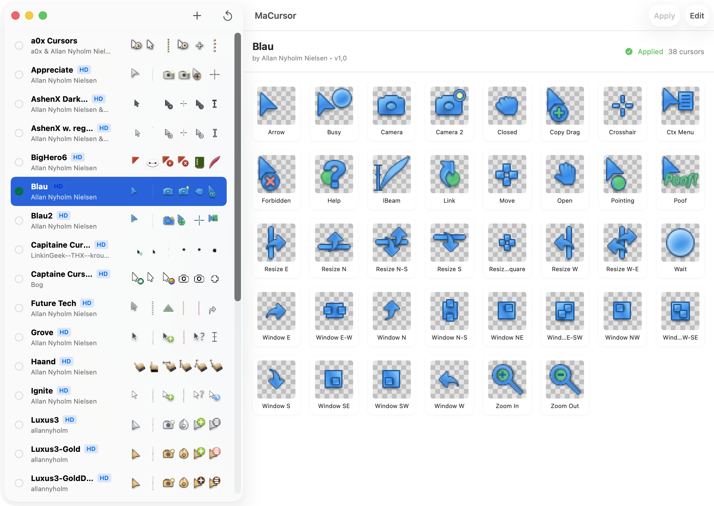

<div align="center">


# MaCursor

**Custom cursor themes for macOS.**

[](https://github.com/writronic/MaCursor/releases/latest)


[](LICENSE)
[](https://github.com/sponsors/writronic)

</div>

---

MaCursor lets you replace every macOS system cursor — arrow, I-beam, crosshair, wait spinner, and more — with custom artwork of your own. Browse 34+ built-in themes, import Windows `.cur` / `.ani` cursor files, design your own from scratch in the visual editor, and switch between themes instantly with global hotkeys.

Requires **macOS 15 Sequoia** or later.

<p align="center">
  
</p>

## Features

- **34+ Built-in Themes** — Ships with a curated themes, ready to apply
- **One-Click Apply** — Double-click any theme to instantly replace all system cursors
- **Full Theme Editor** — Create and edit themes with a split-pane editor: metadata, cursor list, per-cursor image slots, hotspot editing, and animated cursor preview
- **Windows Cursor Import** — Drag & drop `.cur` and `.ani` files to import Windows cursors, including animated cursors with sprite sheet composition
- **HiDPI / Retina Support** — Separate 1× and 2× image representations per cursor for crisp rendering on Retina displays
- **Cursor Scale** — Adjust cursor size from 1.0× to 4.0× with a live slider
- **Global Hotkeys** — Assign keyboard shortcuts to favorite themes for instant switching from anywhere
- **Background Helper Tool** — Lightweight login item (`macursorhelper`) that keeps shortcuts active and reapplies your theme across user switches
- **Auto-Updates** — Built-in Sparkle integration for seamless over-the-air updates
- **Light / Dark / System Appearance** — Full appearance mode control
- **10 Languages** — English, Deutsch, Español, Français, Nederlands, Русский, Türkçe, 日本語, 简体中文, العربية
- **macOS Tahoe Ready** — Includes cursor identifiers for macOS 26 Tahoe's new "S" variant cursors

## Install

Download the latest `.dmg` from the [Releases page](https://github.com/writronic/MaCursor/releases/latest). Both Apple Silicon (arm64) and Intel (x86_64) builds are available. Every release is **code-signed, notarized, and stapled** by Apple — macOS Gatekeeper will let you open it without any warnings.

## Usage

### Applying a Theme

Select a theme from the sidebar and click **Apply**, or simply double-click it. The theme persists across app relaunches.

### Restoring System Cursors

Click the **Restore** button (↺) in the toolbar to reset all cursors to macOS defaults.

### Importing Themes

Import `.cursor` theme files by double-clicking, dragging onto the library window, or via **File → Import Theme**.

### Editing a Theme

Right-click a theme → **Edit**, or select it and click **Edit** in the toolbar. The editor opens in a dedicated window with:

| Pane              | Description                                                                                                        |
| ----------------- | ------------------------------------------------------------------------------------------------------------------ |
| **Metadata**      | Theme name, author, version, HiDPI toggle                                                                          |
| **Cursor List**   | All cursors in the theme, sorted alphabetically                                                                    |
| **Cursor Detail** | Image drop zones for 1×, 2×, 5×, and 10× representations, hotspot coordinates, frame count, and animation duration |

Drop `.png`, `.cur`, or `.ani` files directly onto the representation slots in the editor to add or replace cursor images.

### Importing Windows Cursors (.cur / .ani)

You can add Windows cursor files directly into any theme via the editor:

1. Right-click a theme → **Edit** (or select it and click **Edit** in the toolbar).
2. Drag `.cur` or `.ani` files from Finder onto the **Cursor List** pane (left side of the editor).
3. Each dropped file is imported as a new cursor entry with its images and animation data preserved.
4. Assign the imported cursor to the desired cursor type (e.g., Arrow, I-Beam, Wait) from the cursor detail pane.
5. Click **Save**.

> [!TIP]
> You can drag multiple `.cur` and `.ani` files at once. Animated `.ani` files are imported with their full sprite sheet and animation timing intact.

### Global Shortcuts

1. Open **Settings → General → Helper Tool** and install the helper.
2. Switch to the **Shortcut** tab.
3. Add slots, assign a theme and a key combination to each.
4. Press your shortcut from any app to switch cursors instantly.

> [!IMPORTANT]
> Global shortcuts require the **Helper Tool** to be installed and running. The helper is a lightweight login item that registers system-wide hotkeys and reapplies your cursor theme on user switches.

## Development

### Build from Source

1. Clone the repository:
   ```sh
   git clone https://github.com/writronic/MaCursor.git
   cd MaCursor/Project
   ```
2. Open `MaCursor.xcodeproj` in Xcode 16+.
3. Build and run the **MaCursor** scheme.

> [!NOTE]
> MaCursor uses [Sparkle](https://sparkle-project.org) via Swift Package Manager. Xcode resolves the dependency automatically on first open.

## Contributing

Contributions are welcome! Please read [CONTRIBUTING.md](.github/CONTRIBUTING.md) before getting started.

### Bug Reports & Feature Requests

Search existing issues before opening a new one. Use the Bug Report or Feature Request template to ensure your report includes all necessary details.

### Localization

MaCursor supports 10 languages. Translation files are located in `MaCursor/Resources/l10n/` — each language has its own `.lproj/Localizable.strings` file. Pull requests for new or improved translations are welcome.

### Cursor Themes

Created a theme you'd like to share? Submit it to the built-in gallery — see the [contributing guide](.github/CONTRIBUTING.md#submitting-a-theme-to-the-gallery) for instructions.

### Code

Fork the repository, create a feature branch, and open a pull request. Please follow the [pull request template](.github/PULL_REQUEST_TEMPLATE.md) and keep changes focused.

## Credits

MaCursor is based on [Mousecape](https://github.com/alexzielenski/Mousecape), re-engineered with a modernized architecture and native SwiftUI experience.

## License

MaCursor is available under the [GPL-3.0 license](LICENSE).

---

<div align="center">

**Made with ❤️ by Writronic**

</div>
