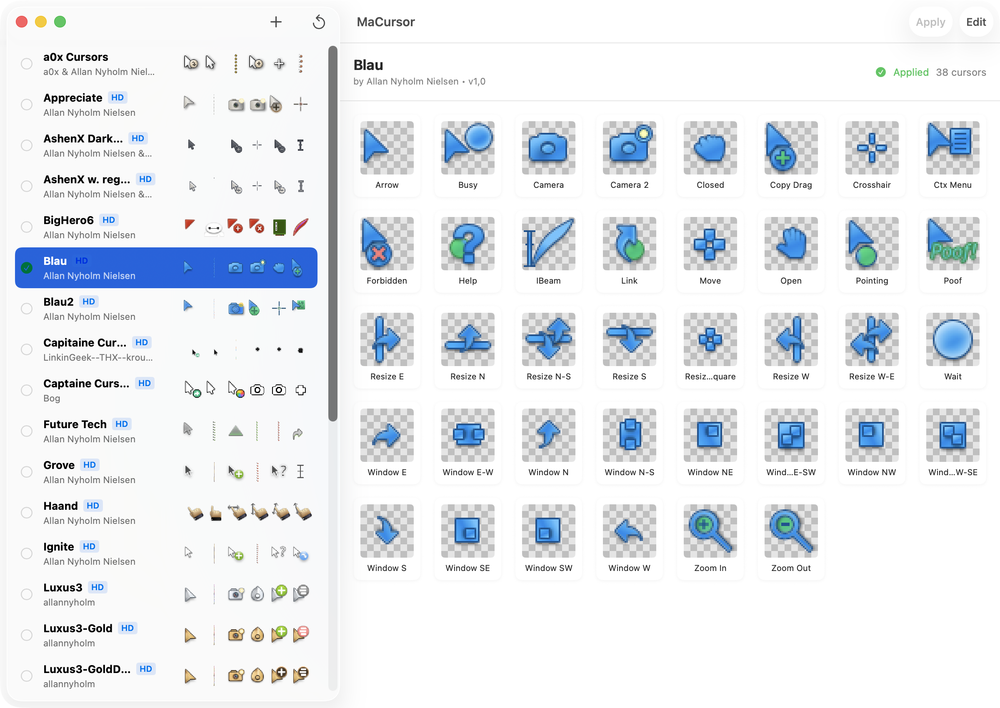

<div align="center">


# MaCursor

**Cursor Control for macOS**

[](https://github.com/writronic/MaCursor/releases/latest)


[](LICENSE)
[](https://github.com/sponsors/writronic)

</div>

---

MaCursor gives you control over system cursors on macOS. You can replace macOS cursors with your own artwork or with ready-made themes, fine-tune every detail in the visual editor, and switch between them instantly with global hotkeys.

Requires **macOS 13 Ventura** or later.

<p align="center">
  
</p>

## Features

- **80+ Ready-to-Apply Themes** — Browse and download curated cursor themes from the Theme Gallery
- **Menu Bar Panel** — Your favorite themes, the cursor for the app in front, and the cursor scale, Cursor Shadow and Focus on Hover controls, all in the menu bar without opening the window
- **Theme Automation** — Your cursor changes itself on a Day and Night schedule, or follows the system appearance and switches with Light and Dark mode
- **Per-App Themes** — Each app can have its own cursor theme, and MaCursor switches to it when that app comes to the front
- **Focus on Hover** — The window under your pointer becomes active after a short pause, without clicking; it needs Accessibility access for the helper
- **Convert Windows, Linux & Mousecape Themes** — A Windows cursor folder (`.cur` / `.ani`), a Linux Xcursor theme folder or a Mousecape `.cape` file becomes a native `.cursor` theme, with every mapped cursor listed for review before it reaches your library
- **Full Theme Editor** — A split-pane editor for building and refining themes: metadata, cursor list, per-cursor image slots, hotspot editing, and animated cursor preview
- **Cursor Scale** — Adjust cursor size from 0.50× to 4.00× with a precision slider (0.1× steps), or type any custom value and press Enter to apply
- **Left / Right Hand Mode** — Cursor orientation for left-handed or right-handed mouse use

<details>
<summary><b>Full feature list</b>: 12 more, including the editor tools, the app languages, and macOS Tahoe support</summary>

### Applying & Switching

- **One-Click Apply** — One double-click on a theme replaces every system cursor
- **Global Hotkeys** — Assign keyboard shortcuts to favorite themes for instant switching from anywhere

### Editor

- **Live Hotspot Editor** — You place the click point on the cursor image itself, and the X / Y values update as the marker moves
- **Live Preview** — A preview strip that turns your real pointer into the cursor you're editing, marks where it actually clicks, and shows it against black and white side by side
- **Animated GIF Import** — An animated `.gif` dropped on a cursor slot becomes a sprite sheet, with its frame timing worked out for you
- **HiDPI / Retina Support** — Separate 1× and 2× image representations per cursor for crisp rendering on Retina displays

### Appearance & Interface

- **Cursor Shadow** — A soft shadow under the pointer
- **Light / Dark / System Appearance** — Full appearance mode control
- **11 Languages** — English, Deutsch, Español, Français, Nederlands, Polski, Русский, Türkçe, 日本語, 简体中文, العربية

### System

- **Background Helper Tool** — Lightweight login item (`MaCursorHelper`) that keeps shortcuts active and reapplies your theme across user switches
- **Auto-Updates** — Built-in Sparkle integration for over-the-air updates
- **macOS Tahoe & Golden Gate Ready** — Full support for macOS 26 Tahoe and macOS 27 Golden Gate, including automatic handling of new S-variant cursor identifiers

</details>

## Quick Start

Get up and running in under a minute:

### 1. Install MaCursor

Download the latest `.dmg` from the [Releases page](https://github.com/writronic/MaCursor/releases/latest), open it, and drag MaCursor to your Applications folder.

### 2. Get Themes

Browse `.cursor` theme files in the [Theme Gallery](https://github.com/writronic/MaCursor/blob/main/themes/README.md) or grab them all from the [Releases page](https://github.com/writronic/MaCursor/releases/latest). Already have a Windows or Linux cursor theme? Use **File → Convert Theme…** instead.

### 3. Import & Apply

Double-click any `.cursor` file, drag & drop it onto the MaCursor library window, or use **File → Import Theme**. Then select the theme and click **Apply**.

### 4. Make It Permanent (Recommended)

Without the helper tool, cursors reset after a restart or user switch. To keep your theme active permanently:

1. Open **MaCursor → Settings → General**.
2. Click **Install** next to **Helper Tool**.
3. That's it — the helper runs silently at login and reapplies your theme automatically.

> [!IMPORTANT]
> The helper tool is a lightweight login item. It uses minimal resources and keeps your chosen cursor theme across restarts, sleep/wake cycles, and user switches.

## Install

Download the latest `.dmg` from the [Releases page](https://github.com/writronic/MaCursor/releases/latest). The app ships as a **universal binary** (Apple Silicon + Intel). Every release is **code-signed, notarized, and stapled** by Apple.

## Usage

### Applying a Theme

Select a theme from the sidebar and click **Apply**, or simply double-click it. The theme persists across app relaunches.

### Restoring System Cursors

Click the **Restore** button (↺) in the toolbar to reset all cursors to macOS defaults.

### Using the Menu Bar Panel

The menu bar panel puts the everyday controls one click away. It belongs to the Helper Tool, so it keeps working while MaCursor itself is closed.

1. Open **MaCursor → Settings → General** and install the **Helper Tool**. Until you do, **Show Menu Bar Icon** stays greyed out and reads *The menu bar icon is provided by the Helper Tool. Install it above to use it.*
2. Turn on **Show Menu Bar Icon**. A MaCursor pointer appears in the menu bar. If it does not, open System Settings and look in the **Menu Bar** section.
3. Star the themes you want to reach from the panel: select a theme and click the star (**Add to Favorites**) in the toolbar, or right-click it in the sidebar and choose the same command. The panel shows favorites only.

Click the menu bar icon to open the panel:

| Section            | What you get                                                                                                                                                                       |
| ------------------ | ---------------------------------------------------------------------------------------------------------------------------------------------------------------------------------- |
| **Header**         | **Current Cursor** and the theme in use, plus a ↺ button                                                                                                                             |
| **Cursor Themes**  | Your favorites as thumbnails. Click one to apply it. The applied theme is outlined and check-marked                                                                                  |
| **Active App**     | The app in front, with a **Cursor for this app** menu. Pick a theme there and that app gets its own cursor; if **Per-App Themes** was off, choosing a theme turns it on for you       |
| **Quick Controls** | **Cursor Scale**, **Cursor Shadow** and **Focus on Hover**, applied as you change them                                                                                                |

Right-click the menu bar icon for **Open MaCursor**, **Settings...** and **Quit MaCursor**. **Quit MaCursor** quits the app and the Helper Tool together, so the menu bar icon disappears and global shortcuts stop until you open MaCursor again.

Once the icon is showing, the **Panel Background** slider in **Settings → General → Menu Bar** sets how see-through the panel is: the middle of the slider is the standard frosted glass, the minimum is clear, the maximum is solid.

### Adjusting Cursor Scale

Fine-tune the size of every system cursor from the Settings panel:

1. Open **MaCursor → Settings → Cursor Control**.
2. Use the **Cursor Scale** slider to pick a value between **0.50×** and **4.00×** (each tick moves in **0.1×** increments).
3. For a precise value outside the slider stops, type the desired number directly into the scale field and press **Enter** to apply.

The new scale takes effect immediately.

### Cursor Shadow and Hand Mode

Both controls sit beside the scale slider in **Settings → Cursor Control**, under **Appearance**, and both are baked into your theme's artwork as it is installed.

- **Cursor Shadow** draws a soft shadow under the pointer.
- **Mouse Hand** switches between **Right Hand** and **Left Hand**. **Left Hand** mirrors most cursors horizontally and carries the click point across with them, so a pointer that leans right leans left instead. The diagonal window-resize cursors are left alone, since mirroring those would point them the wrong way.

Change either one and MaCursor reapplies your theme straight away.

### Theme Automation

Let MaCursor change your cursor theme on its own, either on a schedule or with your Mac's appearance:

1. Open **MaCursor → Settings → Cursor Control** and turn on **Theme Automation**. This needs the Helper Tool, which you can install from **General → Helper Tool**.
2. **To switch on a schedule**, leave **Match system appearance** off. Pick **AM/PM** or **24 hours** as your time format, then set a start time and a theme for **Day mode** and for **Night mode**. MaCursor switches at those times and keeps that theme until the next one. The two modes must start at different times.
3. **To follow your Mac instead of the clock**, turn on **Match system appearance**, then pick a theme for **Light Appearance** and for **Dark Appearance**. Your cursor changes whenever the system appearance does.

Steps 2 and 3 are alternatives, not both: turning on **Match system appearance** replaces the Day and Night rows with the two appearance rows.

### Per-App Themes

Give individual apps their own cursor:

1. Open **MaCursor → Settings → Cursor Control** and turn on **Per-App Themes**. This needs the Helper Tool too.
2. Click **Add App…**, choose an app, and pick the theme it should use.

Whenever that app comes to the front, MaCursor applies its theme, and puts your usual theme back when you leave it. You can also set the theme for the app in front straight from the menu bar panel.

### Turning On Focus on Hover

Focus on Hover brings the window under your pointer to the front and hands it the keyboard focus after a short pause, so you can type into a window without clicking it first. The Helper Tool does the work, and macOS only lets it move windows once you grant **MaCursorHelper** Accessibility access.

1. Open **MaCursor → Settings → General** and install the **Helper Tool**. Without it the switch is greyed out and reads *Focus on Hover requires the Helper Tool. You can install it from General → Helper Tool.*
2. Switch to the **Cursor Control** tab and turn on **Focus on Hover**.
3. The **Allow Accessibility Access** window appears. Click **Allow for Accessibility** and MaCursor opens **System Settings → Privacy & Security → Accessibility**.
4. Turn on **MaCursorHelper** in that list. Look for **MaCursorHelper**, not MaCursor: the helper is the part that needs the access.
5. The window notices on its own and shows **Access granted**. Click **Let's Go!**.

> [!IMPORTANT]
> The switch reads on only while Focus on Hover is enabled, MaCursorHelper is allowed, and the helper is running. If it flips straight back off, check all three.

### Importing Themes

Import `.cursor` theme files by double-clicking, dragging onto the library window, or via **File → Import Theme**.

### Converting Windows, Linux & Mousecape Themes

**Convert Theme** rebuilds a cursor theme made for another platform as a native `.cursor` theme. Three kinds of source are accepted:

| Source                   | What to choose                                                            |
| ------------------------ | ------------------------------------------------------------------------- |
| **Windows cursor theme** | The folder holding the `.cur` / `.ani` files (and its `.inf` file, if any) |
| **Linux Xcursor theme**  | The theme folder that contains the `cursors` subfolder                     |
| **Mousecape cape**       | A single `.cape` file                                                     |

1. Choose **File → Convert Theme…** (⇧⌘O), then select the cursor theme folder or .cape file.
2. MaCursor reads the source and maps each cursor to its macOS counterpart, then opens a review sheet.
3. Check the **Mapped** list — every cursor that found a macOS slot is shown with its identifier. Open **Warnings & ignored** to see what was skipped and why.
4. Click **Add to Library**, or **Add & Edit…** to go straight into the editor and fine-tune the result.

### Windows Cursors That Look Blurry or Will Not Import

Most Windows and Linux cursor packs ship 32×32 artwork, which is a **1×** image. macOS stretches that to fill a Retina pointer, so the converted theme looks soft. MaCursor does not invent a sharper version for the larger slots, so the sharpness has to come from the source pack.

If the pack includes larger artwork, add it while you are already in the editor:

1. On the review sheet, click **Add & Edit…** instead of **Add to Library**.
2. For each cursor, drop the 64×64 or larger version of the same artwork onto the **2×** slot.

If a `.cur` or `.ani` file will not land on a slot at all, MaCursor could not read it and the drop is ignored without a message. Run the whole folder through **File → Convert Theme…** instead: it lists every file it could not use under **Warnings & ignored**.

### Editing a Theme

Right-click a theme → **Edit**, or select it and click **Edit** in the toolbar. The editor opens in a dedicated window with:

| Pane              | Description                                                                                                                                              |
| ----------------- | -------------------------------------------------------------------------------------------------------------------------------------------------------- |
| **Metadata**      | Theme name, creator, version, HiDPI toggle                                                                                                               |
| **Cursor List**   | All cursors in the theme, sorted alphabetically, shown as a list or a grid, with a search field and a **Show All** toggle that reveals the empty slots     |
| **Cursor Detail** | Image drop zones for 1×, 2×, 5×, and 10× representations, hotspot coordinates and hotspot editor, live preview, frame count, and animation duration        |

Drop `.png`, `.gif`, `.cur`, or `.ani` files directly onto the representation slots in the editor to add or replace cursor images.

### Slot Sizes Must Stay in Order

The four representation slots hold the same artwork at increasing pixel sizes, and MaCursor keeps them in order: **10× > 5× > 2× > 1×**. Drop an image that breaks the order and MaCursor refuses it with a **Slot Sizes Out of Order** alert naming the two slots that clash. If a theme reaches the editor already out of order, saving stays blocked until you fix it.

- Put the smallest artwork in **1×** and each larger version in the slot above it, so 32×32 in **1×** and 64×64 in **2×**.
- Each slot must be **strictly larger** than the one below it. The same 32×32 image cannot fill both **1×** and **2×**, which is the usual surprise after converting a Windows pack.
- To change the image in a filled slot, click the red ✕ on its thumbnail first, then drop the new one.
- You do not have to fill every slot. A cursor with **1×** alone is a valid theme.

### Editing the Hotspot

The hotspot is the single point that actually clicks. In the **Hot Spot** section of the cursor detail pane:

1. Drag anywhere on the cursor image — the marker follows your pointer and the **X** and **Y** fields update live.
2. Or type exact coordinates into **X** and **Y** for pixel-perfect placement.

The checkerboard behind the image shows transparency, so you can see exactly where the artwork ends.

### Live Preview

The **Preview** strip under the hotspot editor lets you try a cursor before you save it:

- **Hover** the strip and your real pointer becomes the cursor you're editing.
- **Click** anywhere to drop a bullseye at the exact point the cursor clicked — the quickest way to confirm the hotspot is right.
- The strip is split **black and white**, so you can check that light and dark artwork stays visible on both.
- Animated cursors play at their real frame rate while you hover.

### Tahoe Cursor Variants

macOS 26 Tahoe added S-variant cursor identifiers (`ArrowS`, `IBeamS`). MaCursor keeps them in sync for you: whatever you set for Arrow and I-Beam is mirrored into the matching variant, both when a theme is converted and when you edit one.

Open **Settings → Cursor Control** and turn off **Hide Tahoe cursors** if you'd rather see and edit those variants yourself.

### Global Shortcuts

1. Open **Settings → General → Helper Tool** and install the helper.
2. Switch to the **Shortcut** tab.
3. Add slots, assign a theme and a key combination to each.
4. Press your shortcut from any app to switch cursors instantly.

### Checking the Helper Tool

Theme Automation, Per-App Themes, Focus on Hover, the menu bar panel and global shortcuts all need the Helper Tool, and it is what keeps them running while MaCursor is closed. When one of them is greyed out or quietly stops working, open **MaCursor → Settings → General → Helper Tool** and read the status next to the dot:

| Status                                   | What to do                                                                                                          |
| ---------------------------------------- | --------------------------------------------------------------------------------------------------------------------- |
| **Installed & Active**                   | Nothing. The helper is running                                                                                          |
| **Installed, not running**               | Quit MaCursor and open it again. It restarts the helper for you                                                         |
| **Not Installed**                        | Click **Install**                                                                                                       |
| **Requires Approval in System Settings** | macOS is holding the login item. Open **System Settings → General**, find MaCursor in the login items list, and allow it to run in the background |
| **Helper Not Found**                     | macOS cannot find the bundled helper inside MaCursor. Reinstalling MaCursor is the fix                                   |

### Your Cursor Goes Back to the Default in Other Windows

If your theme applies but the pointer snaps back to the macOS arrow as soon as you move into another window, macOS is taking the cursor back. This happens when the system pointer colours have been changed away from their defaults, because macOS then treats the pointer as system-managed and overrides whatever MaCursor registered.

1. Open **System Settings → Accessibility → Display**.
2. Scroll to the **Pointer** section.
3. Set **Pointer outline color** and **Pointer fill color** back to their defaults, a black outline and a white fill.
4. Return to MaCursor and apply your theme again.

### Cursors MaCursor Cannot Replace

MaCursor replaces the cursors macOS itself registers. An app that paints its own pointer keeps painting it, and no cursor tool can change that. Expect these to stay as they are:

- **Websites with their own cursor**, where the page supplies its own image through CSS.
- **Creative and CAD apps** such as Adobe and Blender, which load brush, pen and lasso tips from inside their own bundle.
- **Canvas and GPU tools** that hide the pointer and draw a brush circle onto their own render surface.
- **Games** whose engine captures the mouse and draws the pointer inside its own frame.
- **Password fields, the Lock Screen and Touch ID prompts**, where macOS forces the signed system cursor so a prompt cannot be spoofed.

If the text cursor is the one reverting, and it happens in dark-themed editors like VS Code or Obsidian, that one you can fix: open the theme with **Edit**, turn on **Show All** in the cursor list, and fill the **IBeamXOR** slot.

## Development

### Build from Source

1. Clone the repository:
   ```sh
   git clone https://github.com/writronic/MaCursor.git
   cd MaCursor/Project
   ```
2. Open `MaCursor.xcodeproj` in Xcode 16+.
3. Build and run the **MaCursor** scheme.

> [!NOTE]
> MaCursor uses [Sparkle](https://sparkle-project.org) via Swift Package Manager. Xcode resolves the dependency automatically on first open.

## Contributing

Contributions are welcome! Please read [CONTRIBUTING.md](.github/CONTRIBUTING.md) before getting started.

### Bug Reports & Feature Requests

Search existing issues before opening a new one. Use the Bug Report or Feature Request template to ensure your report includes all necessary details.

### Localization

MaCursor supports 11 languages. Translation files are located in `MaCursor/Resources/l10n/` — each language has its own `.lproj/Localizable.strings` file. Pull requests for new or improved translations are welcome.

### Cursor Themes

Created a theme you'd like to share? Submit it to the built-in gallery — see the [contributing guide](.github/CONTRIBUTING.md#submitting-a-theme-to-the-gallery) for instructions.

### Code

Fork the repository, create a feature branch, and open a pull request. Please follow the [pull request template](.github/PULL_REQUEST_TEMPLATE.md) and keep changes focused.

## Credits

[Mousecape](https://github.com/alexzielenski/Mousecape)

## License

MaCursor is available under the [GPL-3.0 license](LICENSE).

---

<div align="center">

**Made with ❤️ by Writronic**

</div>