

# Theme Gallery

**Browse 34 cursor themes — click any name to download, or grab them all from the [Releases page](https://github.com/writronic/MaCursor/releases/latest).**

---

### [A0xCursors](https://github.com/writronic/MaCursor/blob/main/themes/A0xCursors.cursor)

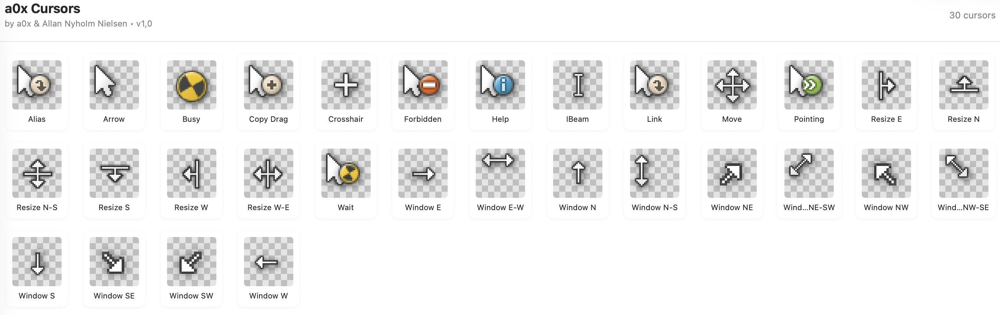

---

### [Appreciate](https://github.com/writronic/MaCursor/blob/main/themes/Appreciate.cursor)

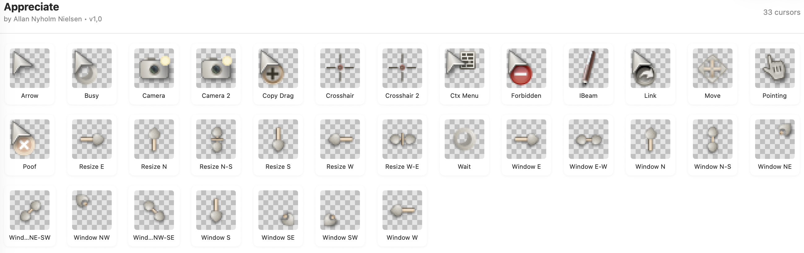

---

### [AshenXDarkWRegularArrow](https://github.com/writronic/MaCursor/blob/main/themes/AshenXDarkWRegularArrow.cursor)

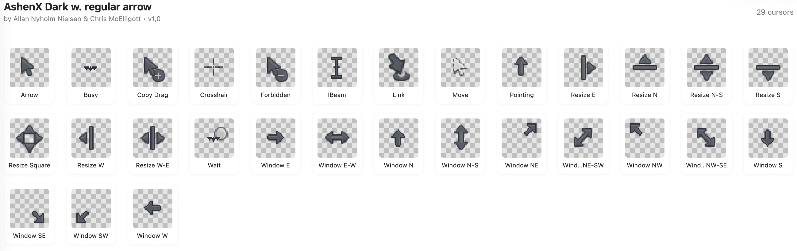

---

### [AshenXWRegularArrow](https://github.com/writronic/MaCursor/blob/main/themes/AshenXWRegularArrow.cursor)

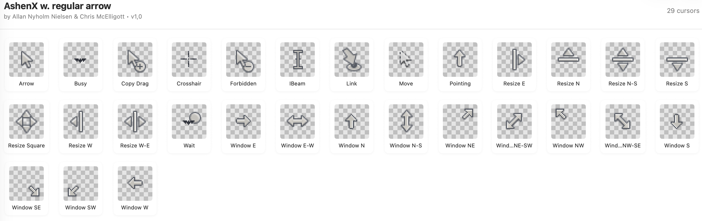

---

### [BigHero6](https://github.com/writronic/MaCursor/blob/main/themes/BigHero6.cursor)

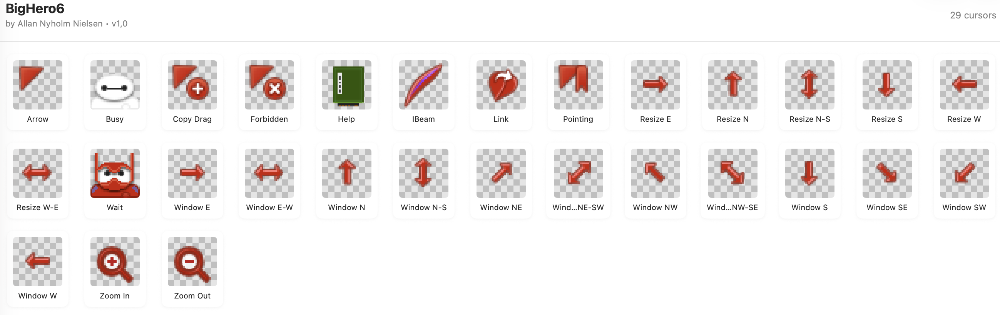

---

### [Blau](https://github.com/writronic/MaCursor/blob/main/themes/Blau.cursor)

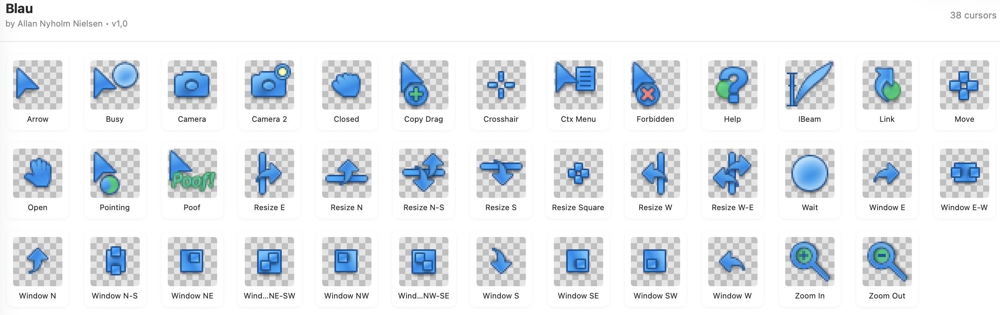

---

### [Blau2](https://github.com/writronic/MaCursor/blob/main/themes/Blau2.cursor)

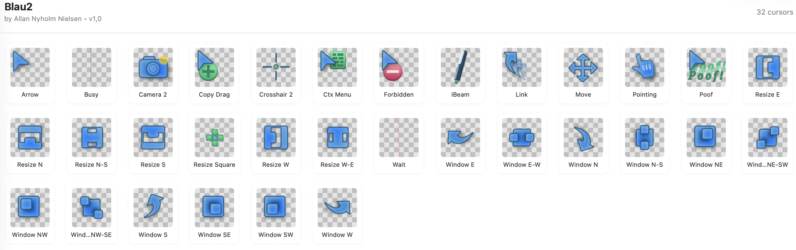

---

### [CapitaineCursors](https://github.com/writronic/MaCursor/blob/main/themes/CapitaineCursors.cursor)

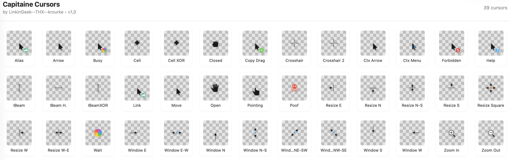

---

### [CaptaineCursorsWhite](https://github.com/writronic/MaCursor/blob/main/themes/CaptaineCursorsWhite.cursor)

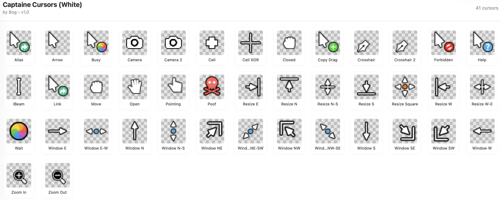

---

### [FutureTech](https://github.com/writronic/MaCursor/blob/main/themes/FutureTech.cursor)

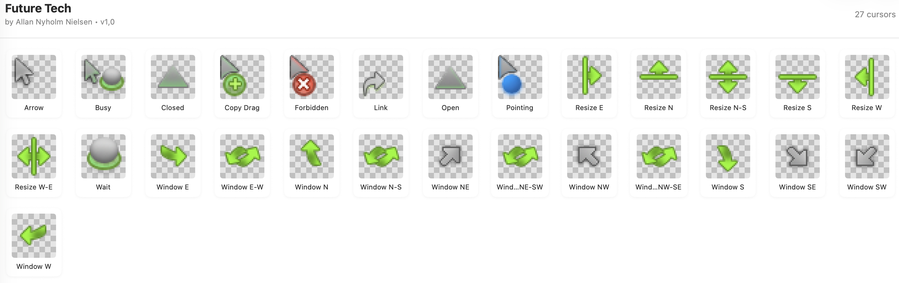

---

### [Grove](https://github.com/writronic/MaCursor/blob/main/themes/Grove.cursor)

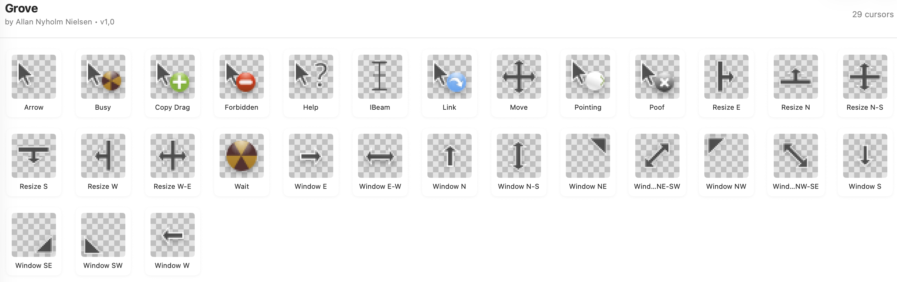

---

### [Haand](https://github.com/writronic/MaCursor/blob/main/themes/Haand.cursor)

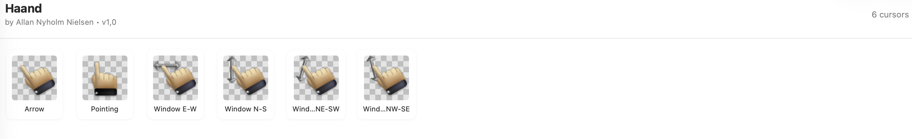

---

### [Ignite](https://github.com/writronic/MaCursor/blob/main/themes/Ignite.cursor)

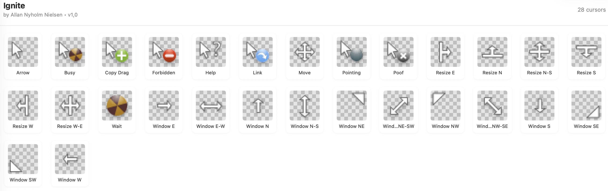

---

### [Luxus3](https://github.com/writronic/MaCursor/blob/main/themes/Luxus3.cursor)

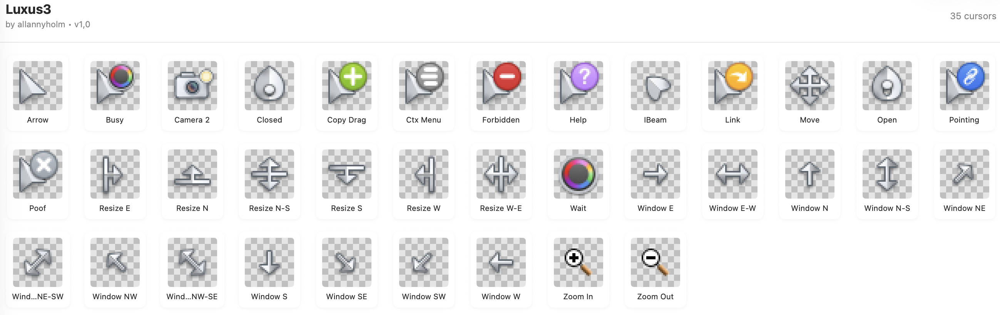

---

### [Luxus3Gold](https://github.com/writronic/MaCursor/blob/main/themes/Luxus3Gold.cursor)

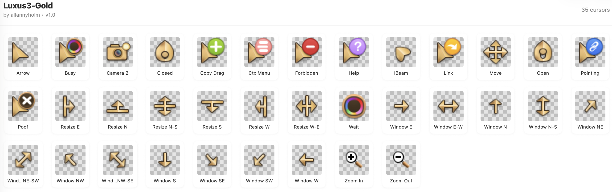

---

### [Luxus3GoldDarkPlate](https://github.com/writronic/MaCursor/blob/main/themes/Luxus3GoldDarkPlate.cursor)

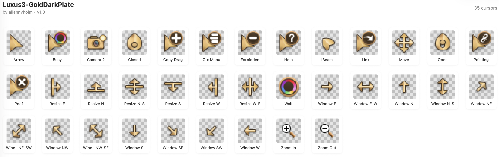

---

### [Luxus3Obsidian](https://github.com/writronic/MaCursor/blob/main/themes/Luxus3Obsidian.cursor)

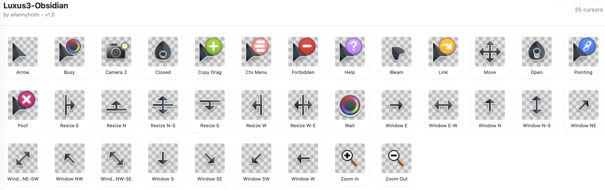

---

### [Luxus3ObsidianDarkPlate](https://github.com/writronic/MaCursor/blob/main/themes/Luxus3ObsidianDarkPlate.cursor)

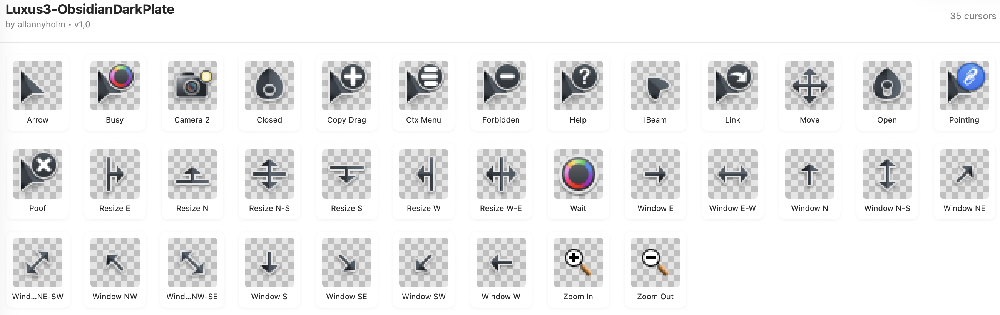

---

### [Memori](https://github.com/writronic/MaCursor/blob/main/themes/Memori.cursor)

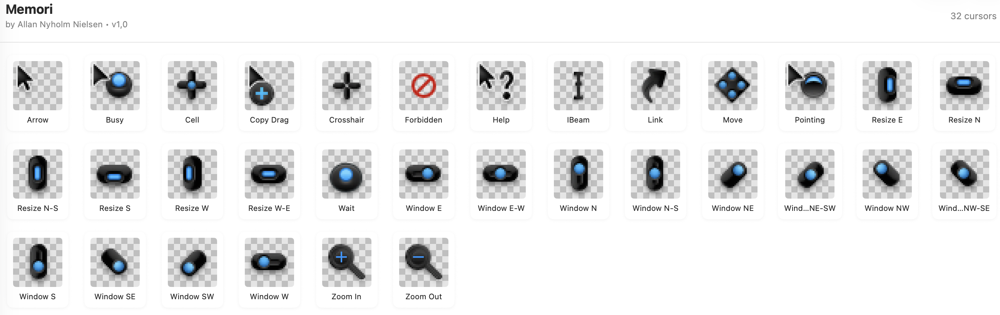

---

### [MetroModern](https://github.com/writronic/MaCursor/blob/main/themes/MetroModern.cursor)

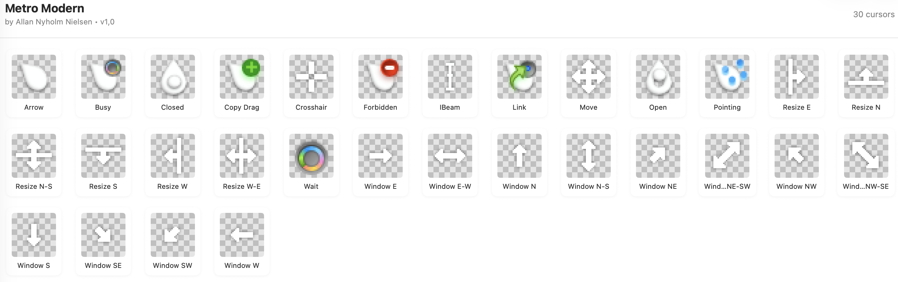

---

### [Mode](https://github.com/writronic/MaCursor/blob/main/themes/Mode.cursor)

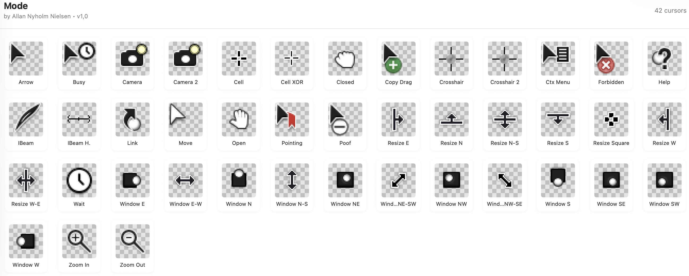

---

### [Mode2](https://github.com/writronic/MaCursor/blob/main/themes/Mode2.cursor)

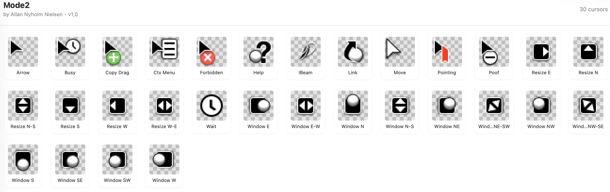

---

### [See](https://github.com/writronic/MaCursor/blob/main/themes/See.cursor)

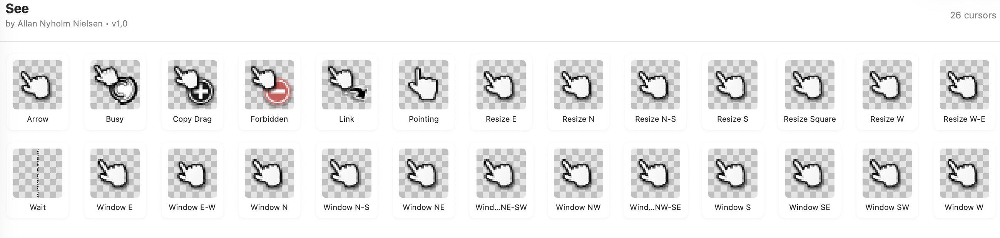

---

### [SvanslösBlue](https://github.com/writronic/MaCursor/blob/main/themes/Svansl%C3%B6sBlue.cursor)

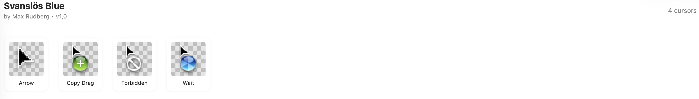

---

### [Tone](https://github.com/writronic/MaCursor/blob/main/themes/Tone.cursor)

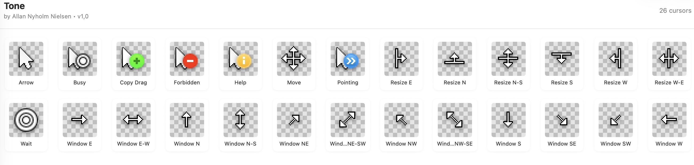

---

### [Unity2016Blue](https://github.com/writronic/MaCursor/blob/main/themes/Unity2016Blue.cursor)

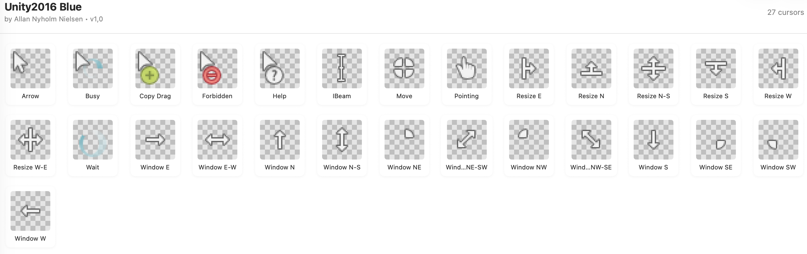

---

### [Unity2016Bright](https://github.com/writronic/MaCursor/blob/main/themes/Unity2016Bright.cursor)

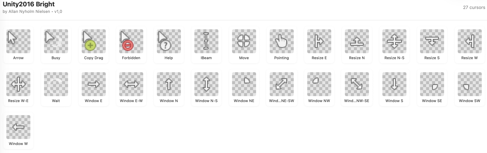

---

### [Unity2016Dark](https://github.com/writronic/MaCursor/blob/main/themes/Unity2016Dark.cursor)

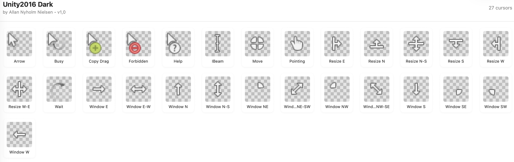

---

### [Unity2016Green](https://github.com/writronic/MaCursor/blob/main/themes/Unity2016Green.cursor)

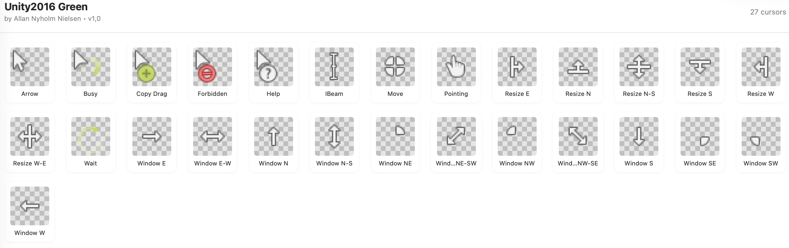

---

### [Unity2016Orange](https://github.com/writronic/MaCursor/blob/main/themes/Unity2016Orange.cursor)

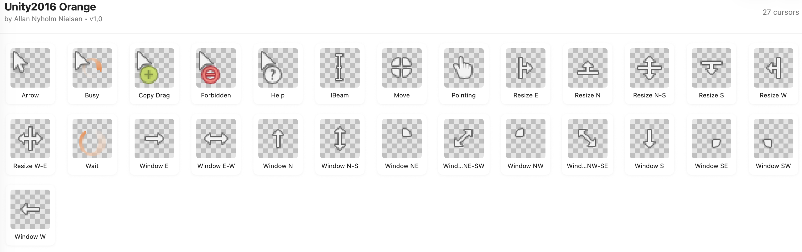

---

### [Unity2016Purple](https://github.com/writronic/MaCursor/blob/main/themes/Unity2016Purple.cursor)

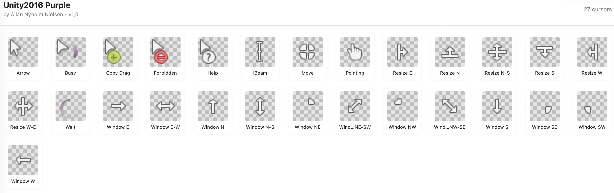

---

### [Unity2016Red](https://github.com/writronic/MaCursor/blob/main/themes/Unity2016Red.cursor)

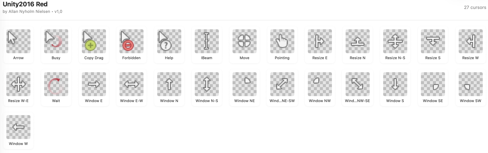

---

### [VisionCursorBlack](https://github.com/writronic/MaCursor/blob/main/themes/VisionCursorBlack.cursor)

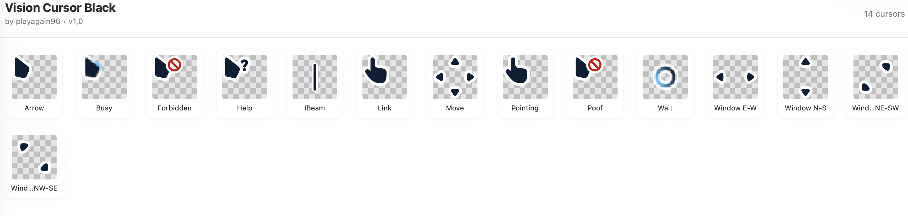

---

### [VisionCursorWhite](https://github.com/writronic/MaCursor/blob/main/themes/VisionCursorWhite.cursor)

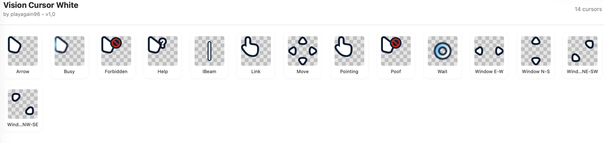

