

# Theme Gallery

**Browse 80+ cursor themes — click any name to download, or grab them all from the [Releases page](https://github.com/writronic/MaCursor/releases/latest).**

---

### [A0xCursors](https://github.com/writronic/MaCursor/blob/main/themes/A0xCursors.cursor)

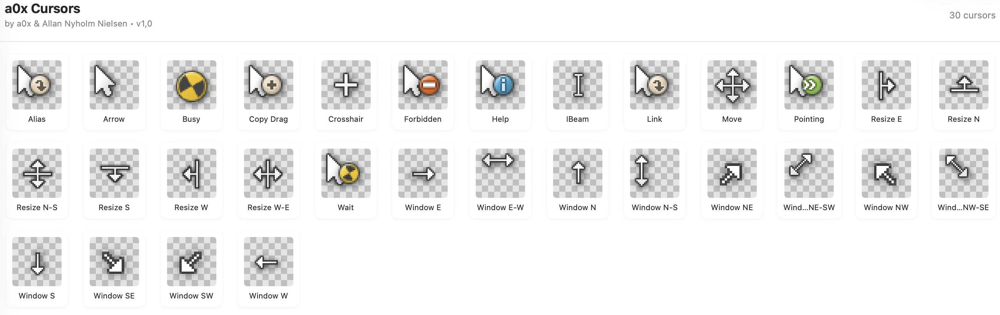

---

### [AWhiteGloveCursor](https://github.com/writronic/MaCursor/blob/main/themes/AWhiteGloveCursor.cursor)

---

### [AYellowGloveCursor](https://github.com/writronic/MaCursor/blob/main/themes/AYellowGloveCursor.cursor)

---

### [Adwaita](https://github.com/writronic/MaCursor/blob/main/themes/Adwaita.cursor)

---

### [AdwaitaRed](https://github.com/writronic/MaCursor/blob/main/themes/AdwaitaRed.cursor)

---

### [Anya](https://github.com/writronic/MaCursor/blob/main/themes/Anya.cursor)

---

### [Appreciate](https://github.com/writronic/MaCursor/blob/main/themes/Appreciate.cursor)

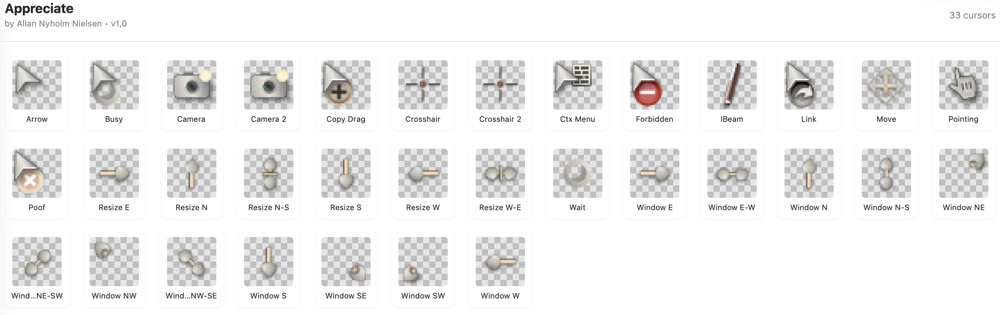

---

### [AshenX](https://github.com/writronic/MaCursor/blob/main/themes/AshenX.cursor)

---

### [AshenXDarkWRegularArrow](https://github.com/writronic/MaCursor/blob/main/themes/AshenXDarkWRegularArrow.cursor)

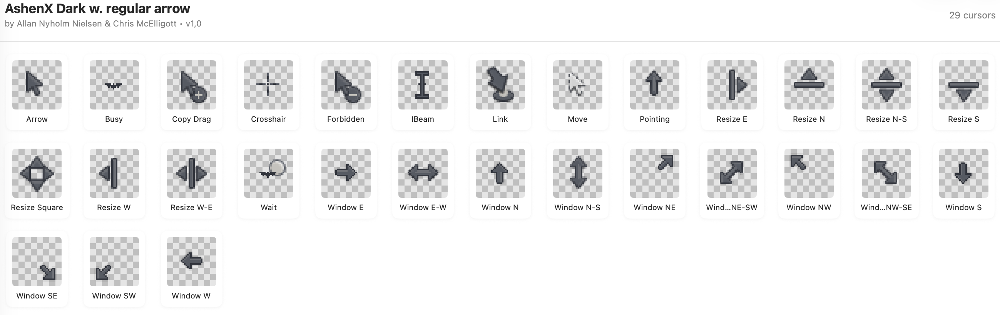

---

### [AshenXWRegularArrow](https://github.com/writronic/MaCursor/blob/main/themes/AshenXWRegularArrow.cursor)

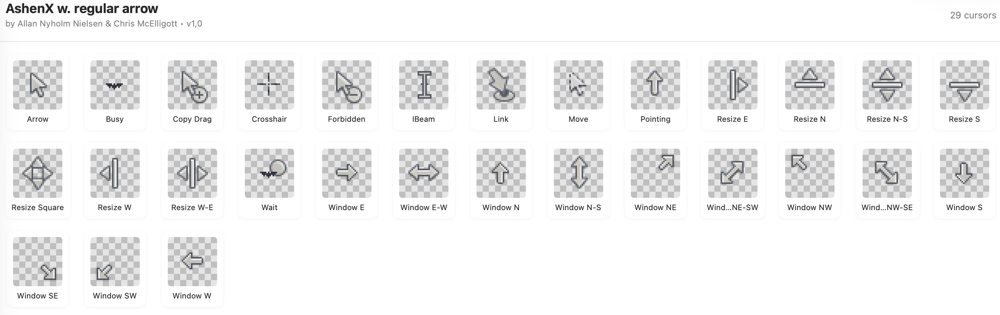

---

### [BibataModernAmber](https://github.com/writronic/MaCursor/blob/main/themes/BibataModernAmber.cursor)

---

### [BibataModernAmberRight](https://github.com/writronic/MaCursor/blob/main/themes/BibataModernAmberRight.cursor)

---

### [BibataModernClassic](https://github.com/writronic/MaCursor/blob/main/themes/BibataModernClassic.cursor)

---

### [BibataModernClassicRight](https://github.com/writronic/MaCursor/blob/main/themes/BibataModernClassicRight.cursor)

---

### [BibataModernIce](https://github.com/writronic/MaCursor/blob/main/themes/BibataModernIce.cursor)

---

### [BibataModernIceRight](https://github.com/writronic/MaCursor/blob/main/themes/BibataModernIceRight.cursor)

---

### [BibataOriginalAmber](https://github.com/writronic/MaCursor/blob/main/themes/BibataOriginalAmber.cursor)

---

### [BibataOriginalAmberRight](https://github.com/writronic/MaCursor/blob/main/themes/BibataOriginalAmberRight.cursor)

---

### [BibataOriginalClassic](https://github.com/writronic/MaCursor/blob/main/themes/BibataOriginalClassic.cursor)

---

### [BibataOriginalClassicRight](https://github.com/writronic/MaCursor/blob/main/themes/BibataOriginalClassicRight.cursor)

---

### [BibataOriginalIce](https://github.com/writronic/MaCursor/blob/main/themes/BibataOriginalIce.cursor)

---

### [BibataOriginalIceRight](https://github.com/writronic/MaCursor/blob/main/themes/BibataOriginalIceRight.cursor)

---

### [BigHero6](https://github.com/writronic/MaCursor/blob/main/themes/BigHero6.cursor)

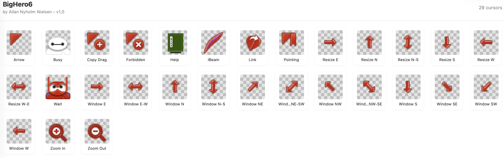

---

### [Blau](https://github.com/writronic/MaCursor/blob/main/themes/Blau.cursor)

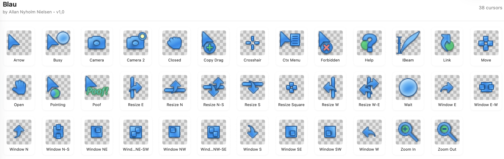

---

### [Blau2](https://github.com/writronic/MaCursor/blob/main/themes/Blau2.cursor)

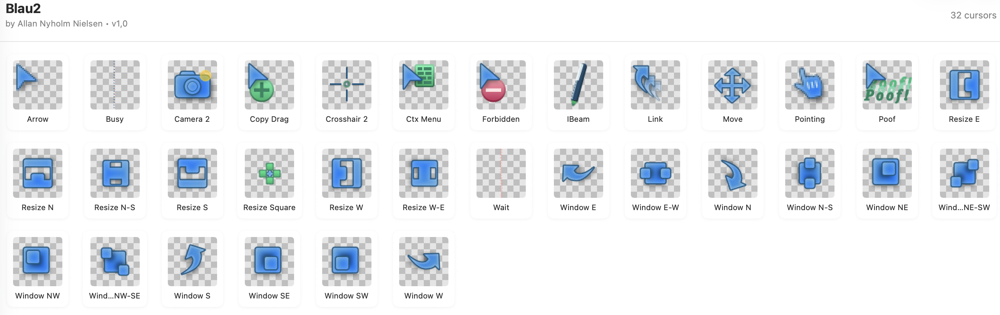

---

### [BreezeXBlack](https://github.com/writronic/MaCursor/blob/main/themes/BreezeXBlack.cursor)

---

### [BreezeXDark](https://github.com/writronic/MaCursor/blob/main/themes/BreezeXDark.cursor)

---

### [BreezeXLight](https://github.com/writronic/MaCursor/blob/main/themes/BreezeXLight.cursor)

---

### [CapitaineCursors](https://github.com/writronic/MaCursor/blob/main/themes/CapitaineCursors.cursor)

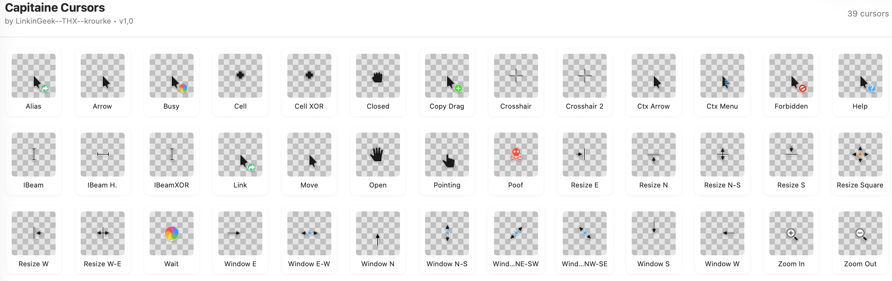

---

### [CaptaineCursorsWhite](https://github.com/writronic/MaCursor/blob/main/themes/CaptaineCursorsWhite.cursor)

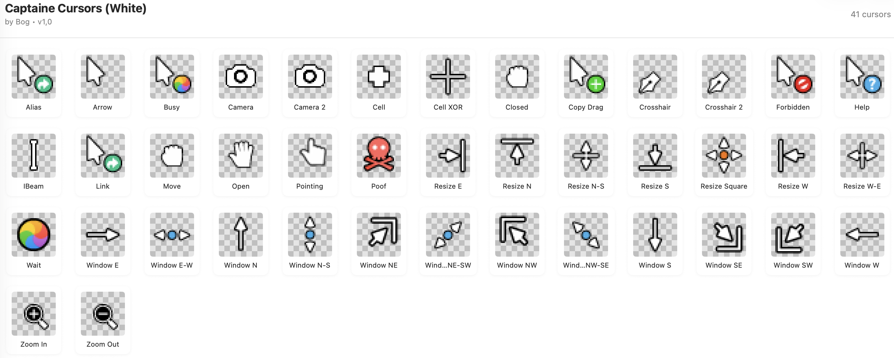

---

### [Empty-Butterfly-White](https://github.com/writronic/MaCursor/blob/main/themes/Empty-Butterfly-White.cursor)

---

### [FutureCursors](https://github.com/writronic/MaCursor/blob/main/themes/FutureCursors.cursor)

---

### [FutureCursorsBlack](https://github.com/writronic/MaCursor/blob/main/themes/FutureCursorsBlack.cursor)

---

### [FutureCursorsCyan](https://github.com/writronic/MaCursor/blob/main/themes/FutureCursorsCyan.cursor)

---

### [FutureCursorsDark](https://github.com/writronic/MaCursor/blob/main/themes/FutureCursorsDark.cursor)

---

### [FutureTech](https://github.com/writronic/MaCursor/blob/main/themes/FutureTech.cursor)

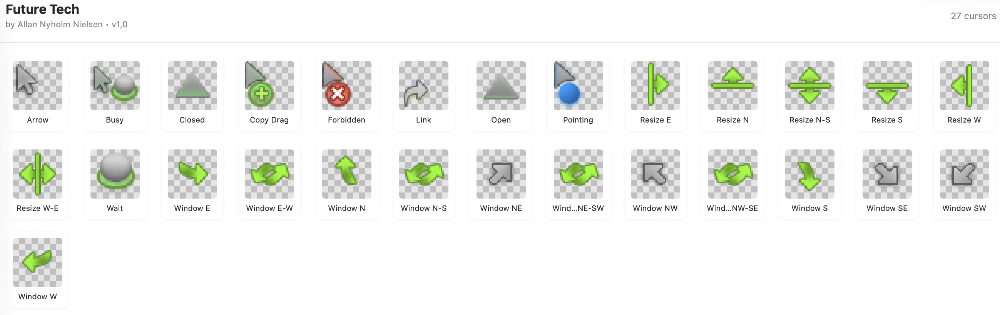

---

### [Grove](https://github.com/writronic/MaCursor/blob/main/themes/Grove.cursor)

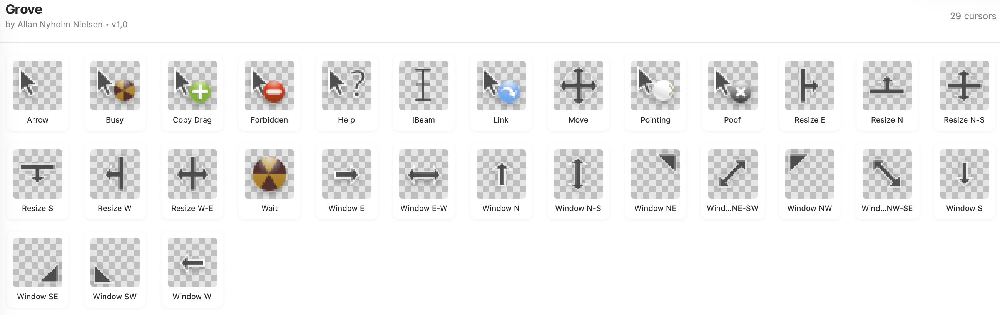

---

### [Haand](https://github.com/writronic/MaCursor/blob/main/themes/Haand.cursor)

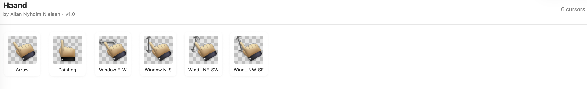

---

### [Ignite](https://github.com/writronic/MaCursor/blob/main/themes/Ignite.cursor)

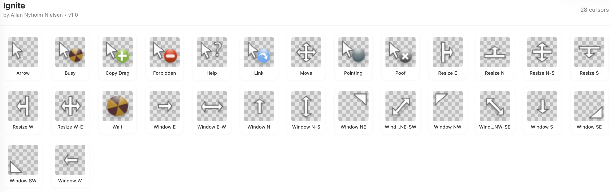

---

### [KalTsit](https://github.com/writronic/MaCursor/blob/main/themes/KalTsit.cursor)

---

### [Klee](https://github.com/writronic/MaCursor/blob/main/themes/Klee.cursor)

---

### [LuoXiaohei](https://github.com/writronic/MaCursor/blob/main/themes/LuoXiaohei.cursor)

---

### [Luxus3](https://github.com/writronic/MaCursor/blob/main/themes/Luxus3.cursor)

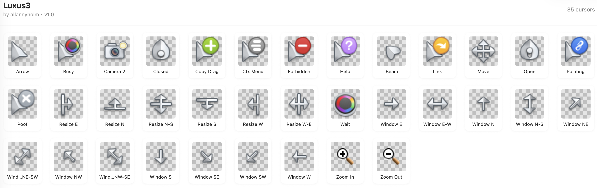

---

### [Luxus3Gold](https://github.com/writronic/MaCursor/blob/main/themes/Luxus3Gold.cursor)

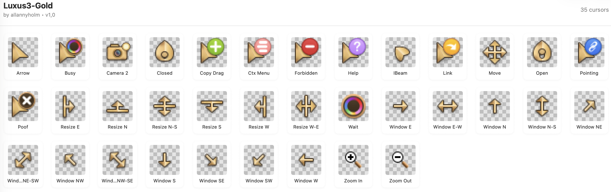

---

### [Luxus3GoldDarkPlate](https://github.com/writronic/MaCursor/blob/main/themes/Luxus3GoldDarkPlate.cursor)

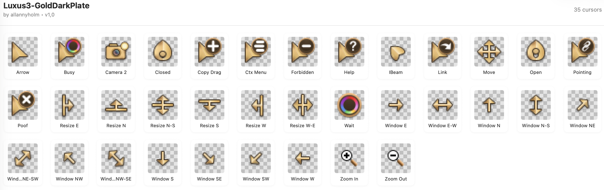

---

### [Luxus3Obsidian](https://github.com/writronic/MaCursor/blob/main/themes/Luxus3Obsidian.cursor)

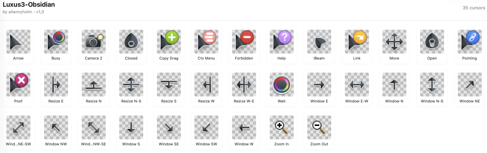

---

### [Luxus3ObsidianDarkPlate](https://github.com/writronic/MaCursor/blob/main/themes/Luxus3ObsidianDarkPlate.cursor)

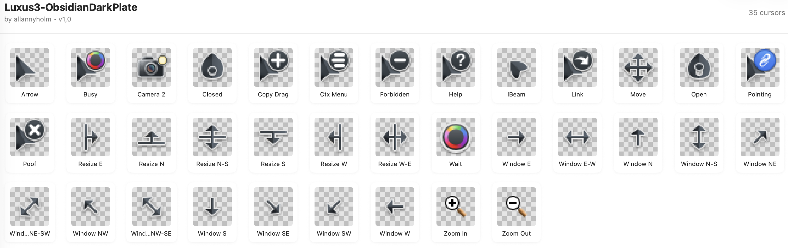

---

### [Luxus3RoseDarkBadge](https://github.com/writronic/MaCursor/blob/main/themes/Luxus3RoseDarkBadge.cursor)

---

### [Luxus3RoseLightBadge](https://github.com/writronic/MaCursor/blob/main/themes/Luxus3RoseLightBadge.cursor)

---

### [LyraB](https://github.com/writronic/MaCursor/blob/main/themes/LyraB.cursor)

---

### [LyraF](https://github.com/writronic/MaCursor/blob/main/themes/LyraF.cursor)

---

### [LyraG](https://github.com/writronic/MaCursor/blob/main/themes/LyraG.cursor)

---

### [LyraP](https://github.com/writronic/MaCursor/blob/main/themes/LyraP.cursor)

---

### [LyraQ](https://github.com/writronic/MaCursor/blob/main/themes/LyraQ.cursor)

---

### [LyraR](https://github.com/writronic/MaCursor/blob/main/themes/LyraR.cursor)

---

### [LyraS](https://github.com/writronic/MaCursor/blob/main/themes/LyraS.cursor)

---

### [LyraX](https://github.com/writronic/MaCursor/blob/main/themes/LyraX.cursor)

---

### [LyraY](https://github.com/writronic/MaCursor/blob/main/themes/LyraY.cursor)

---

### [MD3E Cursors](https://github.com/writronic/MaCursor/blob/main/themes/MD3ECursors.cursor)

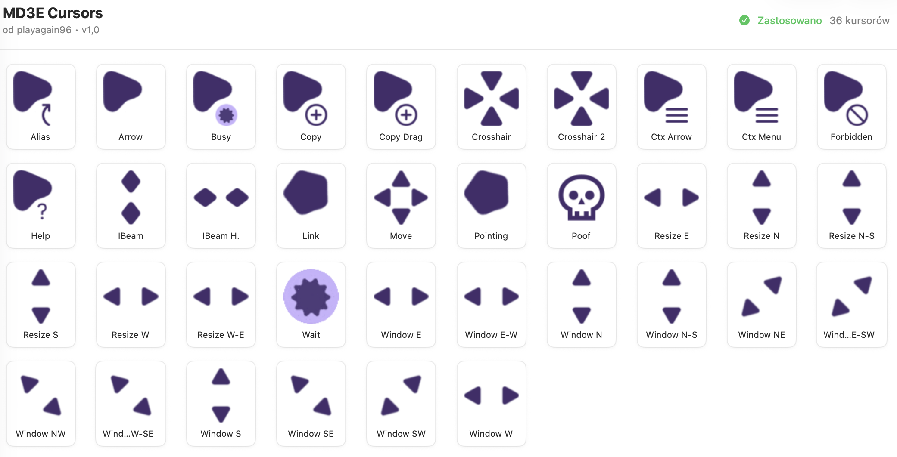

*Created by playagain96 ([DeviantArt](https://www.deviantart.com/playagain96), [GitHub](https://github.com/playagain96))*

---

### [Memori](https://github.com/writronic/MaCursor/blob/main/themes/Memori.cursor)

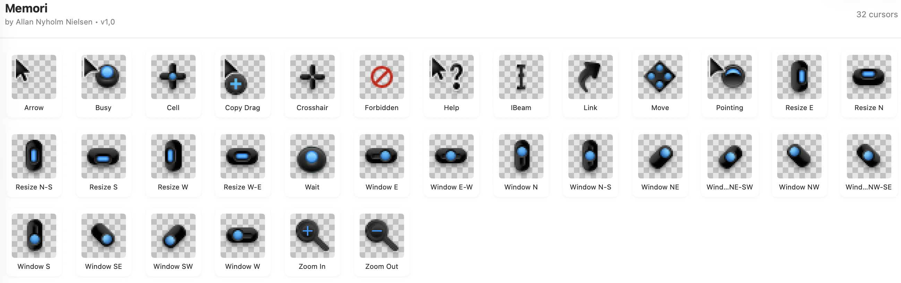

---

### [MetroModern](https://github.com/writronic/MaCursor/blob/main/themes/MetroModern.cursor)

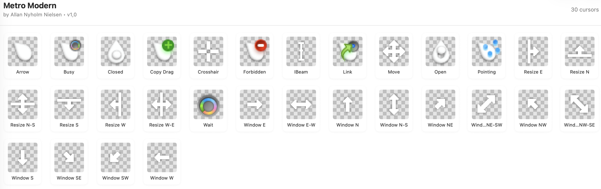

---

### [Mode](https://github.com/writronic/MaCursor/blob/main/themes/Mode.cursor)

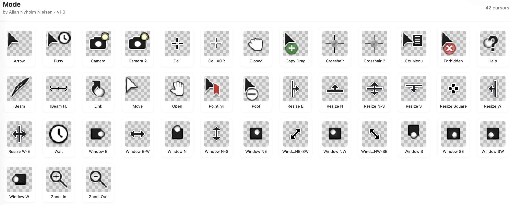

---

### [Mode2](https://github.com/writronic/MaCursor/blob/main/themes/Mode2.cursor)

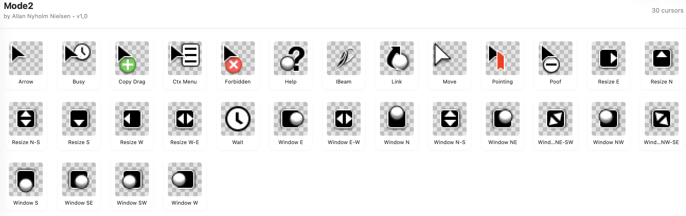

---

### [Mr.Kitty](https://github.com/writronic/MaCursor/blob/main/themes/Mr.Kitty.cursor)

---

### [Obsidian](https://github.com/writronic/MaCursor/blob/main/themes/Obsidian.cursor)

---

### [OreoSparkDarkCursors](https://github.com/writronic/MaCursor/blob/main/themes/OreoSparkDarkCursors.cursor)

---

### [See](https://github.com/writronic/MaCursor/blob/main/themes/See.cursor)

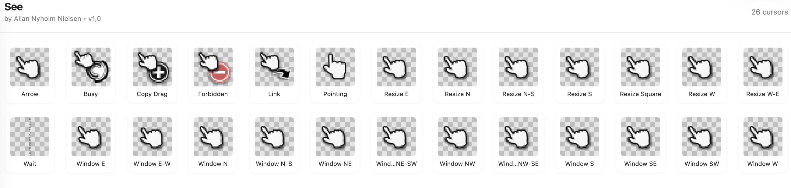

---

### [SomeCursor](https://github.com/writronic/MaCursor/blob/main/themes/SomeCursor.cursor)

---

### [Sunity](https://github.com/writronic/MaCursor/blob/main/themes/Sunity.cursor)

---

### [SvanslosBlue](https://github.com/writronic/MaCursor/blob/main/themes/SvanslosBlue.cursor)

---

### [Tone](https://github.com/writronic/MaCursor/blob/main/themes/Tone.cursor)

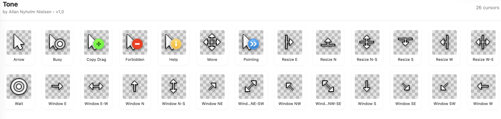

---

### [Unity2016Blue](https://github.com/writronic/MaCursor/blob/main/themes/Unity2016Blue.cursor)

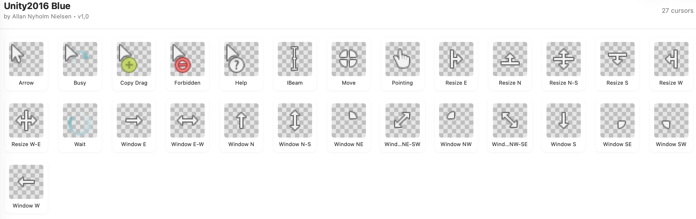

---

### [Unity2016Bright](https://github.com/writronic/MaCursor/blob/main/themes/Unity2016Bright.cursor)

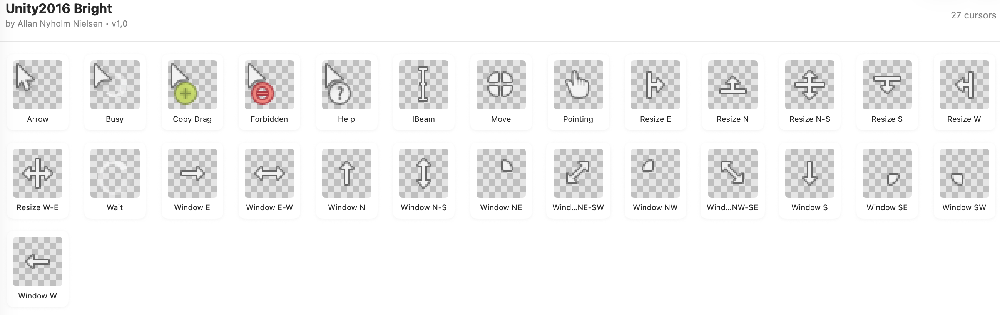

---

### [Unity2016Dark](https://github.com/writronic/MaCursor/blob/main/themes/Unity2016Dark.cursor)

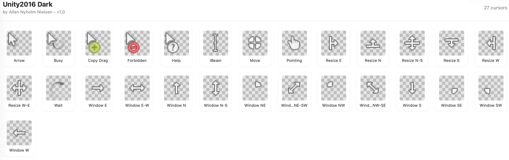

---

### [Unity2016Green](https://github.com/writronic/MaCursor/blob/main/themes/Unity2016Green.cursor)

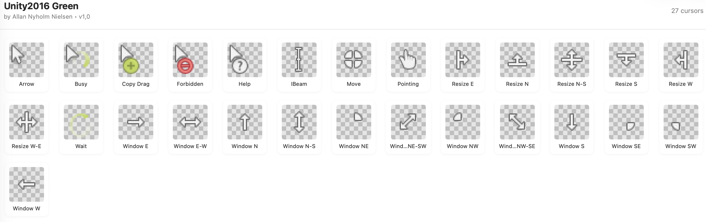

---

### [Unity2016Orange](https://github.com/writronic/MaCursor/blob/main/themes/Unity2016Orange.cursor)

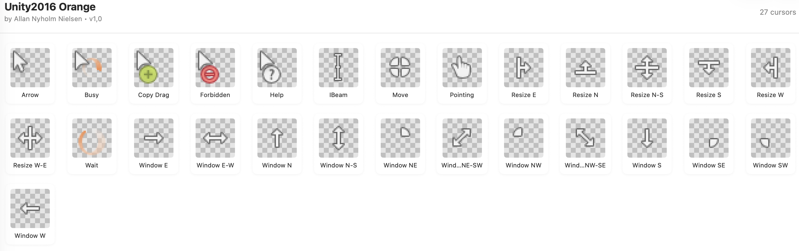

---

### [Unity2016Purple](https://github.com/writronic/MaCursor/blob/main/themes/Unity2016Purple.cursor)

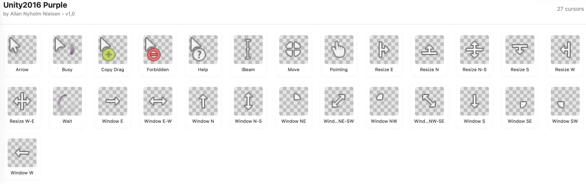

---

### [Unity2016Red](https://github.com/writronic/MaCursor/blob/main/themes/Unity2016Red.cursor)

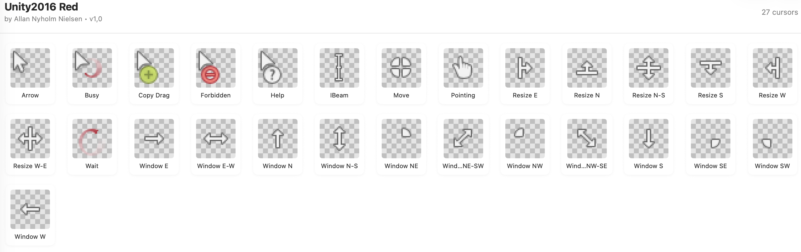

---

### [VimixCursors](https://github.com/writronic/MaCursor/blob/main/themes/VimixCursors.cursor)

---

### [VimixCursorsWhite](https://github.com/writronic/MaCursor/blob/main/themes/VimixCursorsWhite.cursor)

---

### [VisionCursorBlack](https://github.com/writronic/MaCursor/blob/main/themes/VisionCursorBlack.cursor)

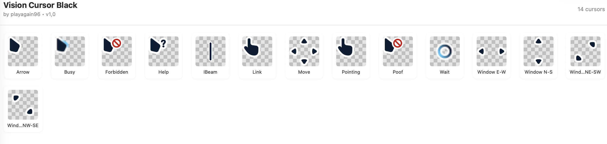

*Created by [IDarques](https://www.deviantart.com/idarques), port by [playagain96](https://github.com/playagain96)*

---

### [VisionCursorWhite](https://github.com/writronic/MaCursor/blob/main/themes/VisionCursorWhite.cursor)

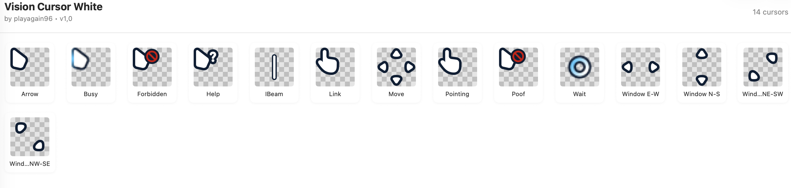

*Created by [IDarques](https://www.deviantart.com/idarques), port by [playagain96](https://github.com/playagain96)*

---

### [VolantesCursors](https://github.com/writronic/MaCursor/blob/main/themes/VolantesCursors.cursor)

---

### [VolantesLightCursors](https://github.com/writronic/MaCursor/blob/main/themes/VolantesLightCursors.cursor)

